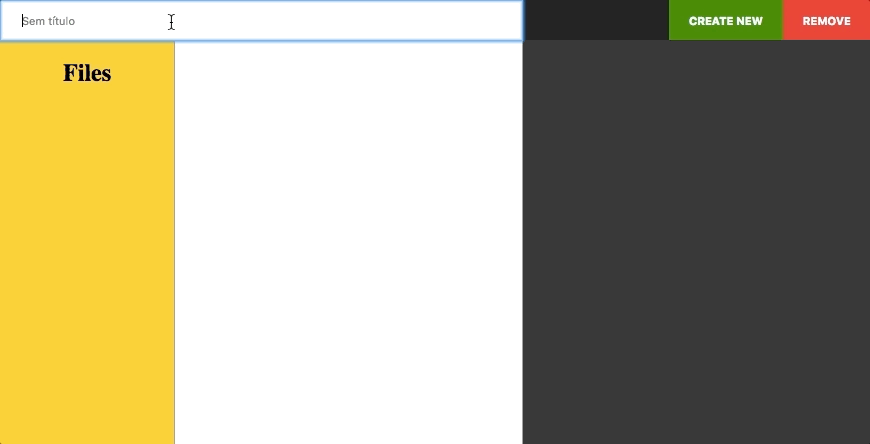
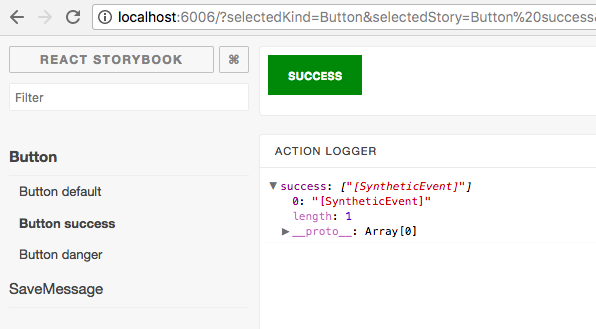

# MARKDOWN EDITOR
> I created this application, in order to apply what I studied with react. This application can edit and creat a markup





## Development setup

I used Yarn how manager of this repo, but you can use npm as well.

I chose to use the standard pattern for this app, in that case I did not need to use a semicolon.

When use install you are installing:
- jest
- storybook
- lint
- some loaders of webpack 2


## Installation

OS X & Linux:

```sh
yarn install or npm install
```
## Starting server
This comand will start server in port:3000, and run webpack 2  with dashboard

```sh
yarn run dev or npm run dev
```

## Up the storybook
The storybook will run in port:6006

```sh
yarn run storybook or npm run storybook
```



## Running tests

```sh
yarn test or npm test
or
yarn test:watch or npm test:watch
```

## Running lint

You can run lint to capture some erros or you can run lint with watch

```sh
yarn run lint ou npm run lin
or
yarn run lint:watch or npm run lint:watch
```
or you can run lint:fix to fix you file
```sh
yarn run lint:fix or npm run lint:fix
```

## Production

You can view files of production running

```sh
yarn run build or npm run build
```

This will separate the files into optimized chunks

